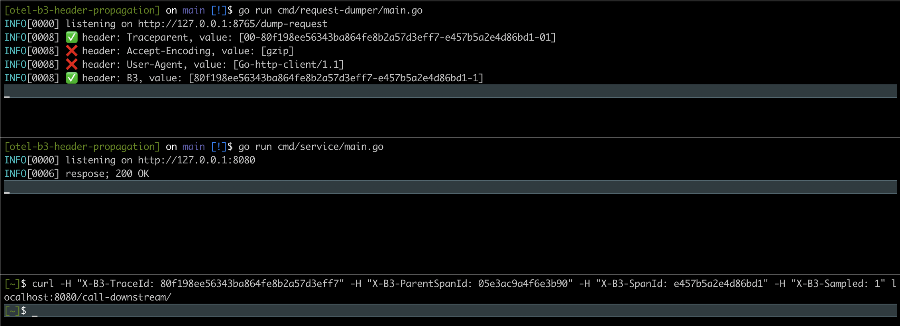

# otel-b3-header-propagation

Example of propagating B3 distributed tracing headers

# how to reproduce?

schema: https://excalidraw.com/#room=9342c8dc730ef357914c,aZsKzyVL8p_-izIVTlcgtQ

## first run the "request dumper" service:

```
go run cmd/request-dumper/main.go

INFO[0000] listening on http://127.0.0.1:8765/dump-request
```

This will simply dump all headers from an incoming request on endpoint http://127.0.0.1:8765/dump-request

## then run the service itself

```
go run cmd/service/main.go

INFO[0000] listening on http://127.0.0.1:8080
```

## then make request

Then make a request to the service and provide the B3 headers, which need to be propagated.

```
curl -H "X-B3-TraceId: 80f198ee56343ba864fe8b2a57d3eff7" -H "X-B3-ParentSpanId: 05e3ac9a4f6e3b90" -H "X-B3-SpanId: e457b5a2e4d86bd1" -H "X-B3-Sampled: 1" localhost:8080/call-downstream/
```

### output

I would expect that the provided B3 header (`X-B3-Traceid`) will be propagated to the downstream service (request-dumper).
Unfortunately this is not the case.

### screenshot of outcome

